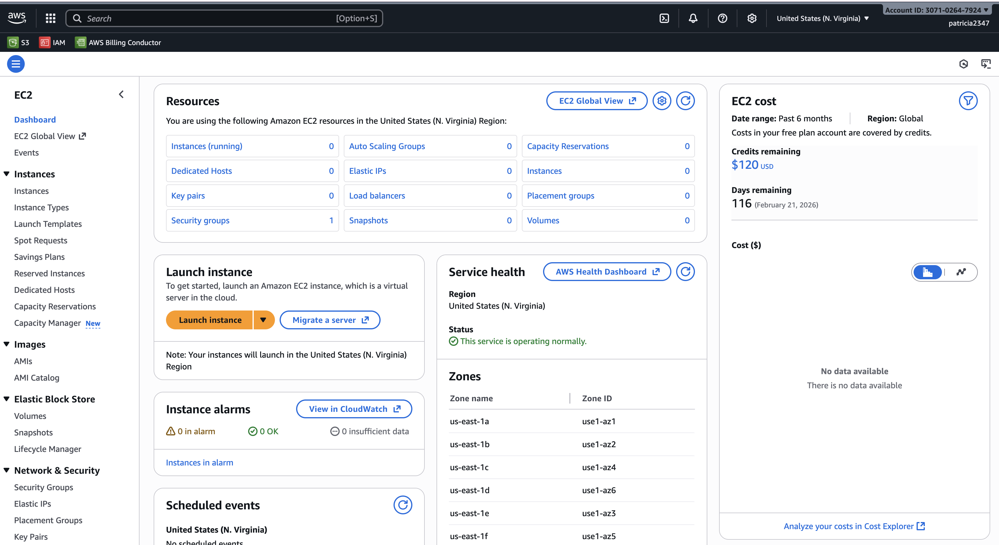
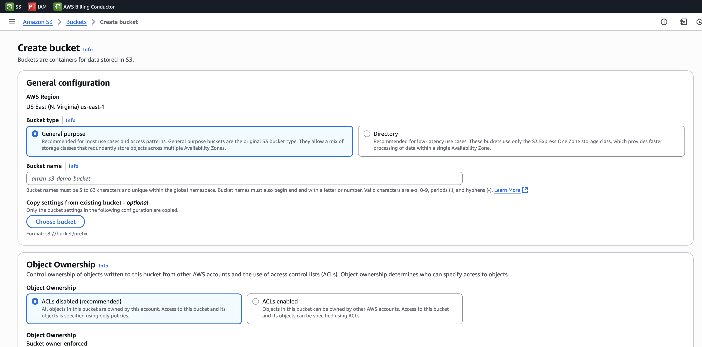
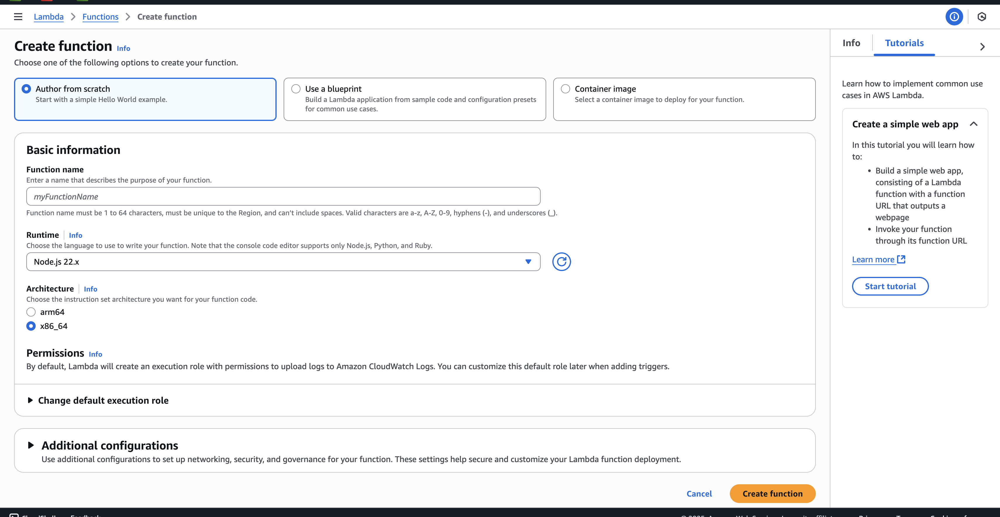

# Module 1 – Project 3: Basic AWS Services

## EC2
- **What it does:** EC2 provides virtual servers (instances) in the cloud that can run applications and services.
- **Notes / Observations:**  
  - Example: Instance types, regions, security groups  
  - Your notes here…
- **Screenshot:**  

## S3
- **What it does:** S3 is scalable object storage for files, backups, and static website hosting.
- **Notes / Observations:**  
  - Example: Buckets, storage classes, versioning  
  - Your notes here…
- **Screenshot:**  

## RDS
- **What it does:** RDS provides managed relational databases in the cloud (MySQL, PostgreSQL, etc.).
- **Notes / Observations:**  
  - Example: Database instances, engines, backup options  
  - Your notes here…
- **Screenshot:**  

## Lambda
- **What it does:** Lambda allows you to run code without managing servers (serverless functions).
- **Notes / Observations:**  
  - Example: Function triggers, runtime options  
  - Your notes here…
- **Screenshot:**  

## IAM
- **What it does:** IAM manages users, groups, roles, and permissions in AWS.
- **Notes / Observations:**  
  - Example: Policies, roles, user management  
  - Your notes here…
- **Screenshot:**  

